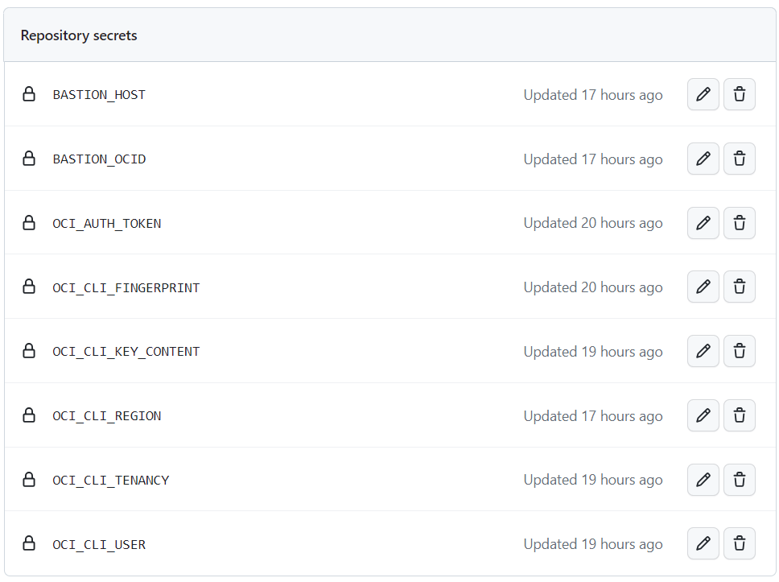
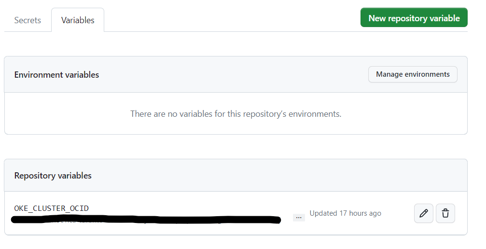
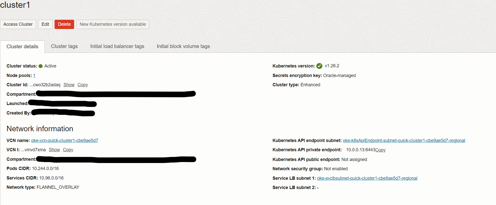
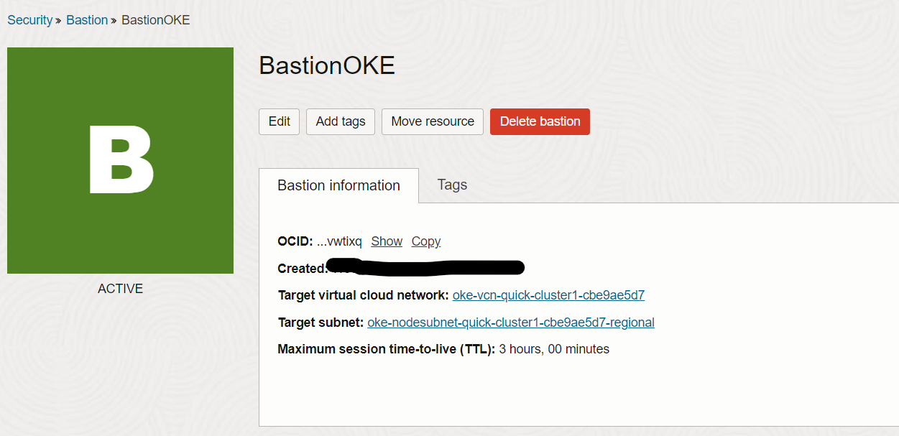

# OKE deployment using Github Actions and Bastion session

Oracle Cloud Infrastructure Container Engine for Kubernetes is a fully-managed, scalable, and highly available service that you can use to deploy your containerized applications to the cloud. 

GitHub Actions workflows are automated processes defined in YAML format that are triggered in response to events in a GitHub repository. 

Workflows can be used to build, test, and deploy applications, automate tasks, and perform various other actions in a GitHub repository.

GitHub Actions workflows can be configured and managed within the repository's .github/workflows directory. Workflows can be triggered by events such as pushes to the repository, pull requests, scheduled intervals, or manual triggers.

In this example, the deployment process to a private OKE cluster is facilitated by a bastion session. This involves a series of steps that utilize bastion session(SSH port forwarding) and `kubectl` commands to carry out the deployment to the OKE cluster.

1. Install OCI CLI tool
2. Setup SSH - creates the  public and private key used for ssh 
3. Create Bastion Session - creates bastion session using the Bastion service
4. Install kubectl
5. Start SSH Tunnel to OKE Cluster - start port forwarding session to k8s private endpoint
6. Configure OKE Cluster - setup kubeconfig for cluster access
7. Deploy to OKE - using kubectl commands
8. Delete basion session

## Pre-requisites

1. Provision an OKE cluster with the Kubernetes API endpoint and worker nodes configured in a private subnet. Please note that the private Kubernetes API endpoint will be utilized for establishing the Bastion port forwarding session.

2. Bastion service created using  OKE VCN as target VCN and OKE node subnet as Target subnet. 

## Required IAM Service Policy
 Please refer to the following links for required IAM service policy to be setup for accesing OKE cluster.

[Policy Configuration for Cluster Creation and Deployment](https://docs.oracle.com/en-us/iaas/Content/ContEng/Concepts/contengpolicyconfig.htm#Policy_Configuration_for_Cluster_Creation_and_Deployment).

[Common Policies](https://docs.oracle.com/en-us/iaas/Content/Identity/Concepts/commonpolicies.htm#top).


## Configuration

1. Github Repository Secrets & Variables -  Please ensure that the following secrets are properly configured with the relevant values according to your specific setup. You can set up secrets by navigating from your repository -> Settings --> Secrets and Variables --> Actions



2. OKE Cluster


3. Bastion


## Deploy and Run
To incorporate the workflow file (ci.yaml) into your repository and tailor it to your requirements, follow these steps:

1. Ensure the ci.yaml file is included in `.github/workflows` directory. 

2. Open the ci.yaml file and make the necessary customizations based on your specific needs. This may involve configuring build steps, defining tests, specifying deployment actions, or any other relevant adjustments.

3. Save the changes to the ci.yaml file.

4. Commit and push the modified ci.yaml file to your repository.

Once the changes are pushed, the workflow will be automatically triggered whenever code is pushed to the repository. This workflow acts as a framework for executing continuous integration tasks and can be further refined to suit your development processes and requirements.

## Test
You can follow the steps below to test the deployment from the workflow run. This involves accessing the OKE cluster locally through an SSH port-forwarding session and verifying the deployment using `kubectl` commands.

### Step 1: Configure OCI-CLI

On your local machine terminal, make sure oci-cli is installed using: 

`oci -v`

If not, follow the below link to install and setup OCI-CLI.

`https://docs.cloud.oracle.com/en-us/iaas/Content/API/SDKDocs/cliinstall.htm`

### Step 2: Create Bastion session

Create a port forwarding bastion session using the Bastion service created previously. Copy the SSH Command and start the SSH tunnel. Please keep this window open. 

__Example:__
`ssh -i <privateKey> -N -L <localPort>:10.0.0.13:6443 -p 22 ocid1.bastionsession.oc1.ca-toronto-1.________amaaaaaantxkdlyawqe2________vap5n3exve76cpt3slm3w7spvyegyuqv2aar2flq@host.bastion.ca-toronto-1.oci.oraclecloud.com`

### Step 3: Access Cluster & Verify deployment
Please use another terminal window and follwo the steps given below.

Please go to the cluster details page and click on "Access Cluster" button, and follwo the steps mentioned in the "Local Access" section:

This will setup the cluster access using kubeconfig file. While the SSH tunnel is to the private endpoint we can now test the deployment using the following commands.
````
kubectl get deployment -n nginx
kubectl get pods -n nginx
````